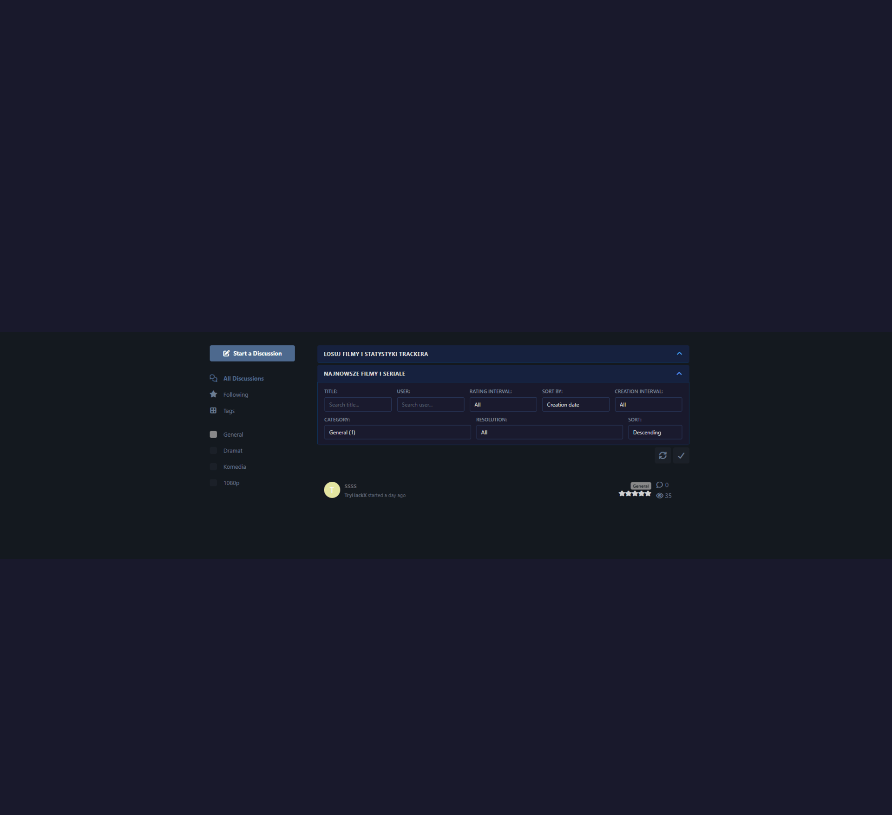

# TryHackX Homepage Blocks

A Flarum extension that adds powerful customizable homepage blocks: random discussion buttons, tracker information panels, dual statistics (internal database + external OpenTracker), advanced discussion filters, custom links, content validation overrides, and reCAPTCHA-protected stats API.

> **Latest (v2.0.1):** Added Section 1 and Section 2 enable/disable toggles. Removed "General" section header from settings page. Moved inline styles to CSS classes. Support button moved to top of admin page with CSS improvements.

## Screenshots



*Admin panel with page management, and live preview.*

## Support Development

If you find this extension useful, consider supporting its development:

- **Monero (XMR):** `45hvee4Jv7qeAm6SrBzXb9YVjb8DkHtFtFh7qkDMxS9zYX3NRi1dV27MtSdVC5X8T1YVoiG8XFiJkh4p9UncqWGxHi4tiwk`
- **Bitcoin (BTC):** `bc1qncavcek4kknpvykedxas8kxash9kdng990qed2`
- **Ethereum (ETH):** `0xa3d38d5Cf202598dd782C611e9F43f342C967cF5`

You can also find the donation option in the extension's admin settings panel.

## Features

- **Random discussion buttons** - Configurable buttons that fetch a random discussion from a specific tag (perfect for "Random HD movie", "Random TV series", etc.). Fully customizable via JSON.
- **Tracker info panel** - Display BitTorrent tracker announce URLs with copy-to-clipboard support, custom message and sub-message.
- **Dual statistics system** - Show both internal forum statistics (from the database) and external OpenTracker statistics side by side:
  - **Internal stats** - Torrents, users, magnets, downloads, views, average rating (pulled directly from the forum database)
  - **External stats (OpenTracker)** - Seeds, peers, completed downloads, uptime. Two modes:
    - **Native** - Direct connection to OpenTracker XML endpoint (`/stats?mode=everything`)
    - **Proxy** - JSON proxy URL for environments where direct access is not possible
  - Configurable refresh interval (1-300 seconds)
- **Custom links bar** - Configurable color-coded link buttons defined via JSON (label, URL, color, external flag).
- **Advanced discussion filters** - Powerful filter bar for the discussion list with 7 filter types:
  - Title search
  - User search
  - Rating interval (requires `tryhackx/flarum-topic-rating`)
  - Date interval (Today, 1 day, 1 week, 2 weeks, 1 month, 3/6 months, 1 year)
  - Category (tag) selection
  - Sort by (Steam DB rating, average rating, rating count, recently rated, creation date, views, magnet clicks)
  - Sort direction (ascending/descending)
- **Content validation overrides** - Override Flarum's built-in title and content length limits without touching the core:
  - Title length: 1-200 characters (varchar(200) column max)
  - Content length: 0-16,000,000 characters (mediumtext column max)
  - Toggle each independently
- **reCAPTCHA protection** - Optional reCAPTCHA v2/v3 protection for the stats API endpoint.
- **Collapsible sections** - Section 1 (random buttons + stats) can be collapsed by default to save space.
- **Hide hero banner** - Optional toggle to hide Flarum's default hero banner.
- **Tag filtering** - Show only tags that have discussions, optionally with discussion counts next to tag names.
- **Polish & English locales** - Fully translated interface.

## Requirements

- Flarum `^2.0.0-beta.7`
- `flarum/tags` (required)

### Suggested extensions

These extensions enhance the functionality but are not required:

- [**fof/discussion-views**](https://github.com/FriendsOfFlarum/discussion-views) - Enables view count statistics and view-based sorting
- [**tryhackx/flarum-topic-rating**](https://github.com/TryHackX/flarum-topic-rating) - Enables rating-based filtering and sorting (Steam DB ratings, average rating, etc.)
- [**tryhackx/flarum-magnet-link**](https://github.com/TryHackX/flarum-magnet-link) - Enables magnet click statistics and magnet-based sorting

## Installation

```bash
composer require tryhackx/flarum-homepage-blocks
php flarum cache:clear
```

## Update

```bash
composer update tryhackx/flarum-homepage-blocks
php flarum cache:clear
```

## Configuration

1. Navigate to the **Administration** panel.
2. Find **TryHackX Homepage Blocks** in the extensions list and enable it.
3. Click the extension to access the configuration sections:

| Section | Description |
|---|---|
| **General** | Section titles, default collapsed state, hero banner toggle, tag display options |
| **Random Movies** | JSON configuration for random discussion buttons |
| **Tracker Info** | Tracker message, sub-message, and announce URLs |
| **Tracker Statistics** | Toggle internal stats, configure external OpenTracker source (native or proxy mode), refresh interval |
| **Custom Links** | JSON configuration for custom link buttons |
| **Content Settings** | Override title and content length limits |
| **Security (reCAPTCHA)** | Optional reCAPTCHA v2/v3 protection for the stats API |

### Random buttons format

```json
[
  {"label": "Random Ultra HD (2160p)", "tag": "ultra-hd-2160p"},
  {"label": "Random Full HD (1080p)", "tag": "full-hd-1080p"},
  {"label": "Random HD (720p)", "tag": "hd-720p"}
]
```

### Custom links format

```json
[
  {"label": "Template Generator", "url": "/generator", "color": "#e74c3c"},
  {"label": "Template Merger", "url": "/merger", "color": "#e74c3c"}
]
```

## Links

- [GitHub](https://github.com/TryHackX/flarum-homepage-blocks)
- [Packagist](https://packagist.org/packages/tryhackx/flarum-homepage-blocks)
- [Report Issues](https://github.com/TryHackX/flarum-homepage-blocks/issues)

## License

MIT License. See [LICENSE](LICENSE) for details.
