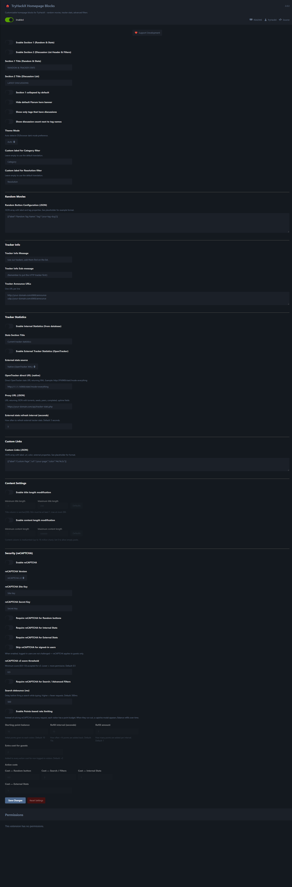

# TryHackX Homepage Blocks

A Flarum extension that adds powerful customisable homepage blocks:
tracker information panels, dual statistics (internal database + external
OpenTracker), advanced discussion filters, content-validation overrides,
and a per-IP rate limiter.

> Designed to plug cleanly into a tracker-style Flarum forum. Works hand
> in hand with the rest of the TryHackX extension family —
> [`tryhackx/flarum-topic-rating`](https://github.com/TryHackX/flarum-topic-rating)
> unlocks rating filters and sorts, [`tryhackx/flarum-magnet-link`](https://github.com/TryHackX/flarum-magnet-link)
> unlocks magnet click stats and sorts, [`fof/discussion-views`](https://github.com/FriendsOfFlarum/discussion-views)
> unlocks view counters / view-based sort.

> **Note:** Recent updates target the **2.x** line only. The **1.x** branch
> (Flarum 1.8+) is **no longer actively developed** — it stays available
> for legacy installs but won't receive new features.

## Screenshots


*Mobile view — discussion list rendered with different combinations of TryHackX extensions (thumbnails + ratings + views, thumbnails + views, thumbnails only, ratings only, views only, vanilla Flarum).*



*TryHackX Homepage Blocks admin panel — section toggles, theme mode, custom filter labels, tracker info / announce URLs, internal & external (OpenTracker) statistics, content title / length overrides and rate-limit settings.*


*Desktop discussion list with the full TryHackX stack — thumbnail sliders on the left, star ratings on the right, magnet button next to each topic.*


*Desktop discussion list — hover state showing the magnet tooltip loading inline (powered by `tryhackx/flarum-magnet-link`).*

## Support Development

If you find this extension useful, consider supporting its development:

- **Monero (XMR):** `45hvee4Jv7qeAm6SrBzXb9YVjb8DkHtFtFh7qkDMxS9zYX3NRi1dV27MtSdVC5X8T1YVoiG8XFiJkh4p9UncqWGxHi4tiwk`
- **Bitcoin (BTC):** `bc1qncavcek4kknpvykedxas8kxash9kdng990qed2`
- **Ethereum (ETH):** `0xa3d38d5Cf202598dd782C611e9F43f342C967cF5`

You can also find the donation option in the extension's admin settings panel.

## Features

- **Tracker info panel** — display BitTorrent tracker announce URLs with
  copy-to-clipboard support, a custom heading and sub-heading.
- **Dual statistics system** — show internal forum stats (from the
  database) and external OpenTracker stats side by side:
  - **Internal stats** — torrents, users, magnets, downloads, views,
    average rating (pulled from the forum database).
  - **External stats (OpenTracker)** — seeds, leechers, peers, completed
    downloads, uptime, fetched directly from the OpenTracker XML endpoint
    (`/stats?mode=everything`). Leechers are derived as `peers − seeds`
    (OpenTracker's `peers` count is the whole swarm).
  - **Shared cache + single-flight** — the backend fetches the tracker at
    most once per *cache lifetime*, globally, and serves everyone from one
    shared cache; when a fetch is already running, other requests are never
    triggered and get the cached/stale value instead. Configurable **cache
    lifetime**, **max fetch time** (large trackers can take ~a minute to
    compute stats) and client **refresh interval**.
- **Advanced discussion filters** — filter bar for the discussion list
  with 7 filter types:
  - Title search
  - User search
  - Rating interval *(requires `tryhackx/flarum-topic-rating`)*
  - Date interval (Today, 1 day, 1 week, 2 weeks, 1 month, 3 / 6
    months, 1 year)
  - Category (tag) selection
  - Sort by — creation date (always available), plus a **Steam-DB-style
    confidence rating**, average rating, rating count and recently rated
    *(with `tryhackx/flarum-topic-rating`)*, views *(with `fof/discussion-views`)*,
    and magnet clicks total / top magnet / recently clicked
    *(with `tryhackx/flarum-magnet-link`)*. Options whose extension isn't
    installed are hidden automatically.
  - Sort direction (ascending / descending)
- **Content-validation overrides** — override Flarum's built-in title
  and content length limits without patching core:
  - Title length: 1–200 characters (`varchar(200)` column max).
  - Content length: 0–16,000,000 characters (`mediumtext` column max).
  - Each toggle is independent.
- **Rate limiting** — a built-in per-IP **points limiter** on the search /
  filters action. Each visitor has a budget that refills over time; when it
  runs out the IP is **temporarily blocked** for a configurable duration and
  the visitor sees a friendly countdown. Client IPs are resolved from Flarum
  core (proxy-aware), so the limit can't be bypassed with a spoofed
  `X-Forwarded-For` header. The per-IP budget is kept on the local filesystem
  with per-IP locking — ideal for a single server; if you run several app
  servers behind a load balancer, front them with a shared store (Redis).
  - **Enforced server-side.** The authoritative charge is a middleware on
    core's `GET /api/discussions` that meters requests carrying the heavy
    `filter[title]` / `filter[user]` (LIKE `%…%`) parameters — so bots,
    scrapers and flooders hitting the API **directly** are throttled and
    blocked *before* the query touches the database, not just users of the
    on-page filter bar. The client-side pre-flight is kept purely for UX
    (instant countdown before a query fires); to avoid double-billing, a
    successful pre-flight grants a short-lived per-IP *grace* that the
    middleware consumes for the follow-up real request. Only heavy
    title/user searches are metered — ordinary browsing and short (<3-char)
    filters are never charged. (A shared cache such as Redis is still
    recommended if you run several app servers, so the per-IP bucket is
    consistent across nodes.)
- **Collapsible sections** — Section 1 (tracker + stats) can be
  collapsed by default to save space.
- **Hide hero banner** — optional toggle to hide Flarum's default hero
  banner.
- **Tag filtering** — show only tags that actually have discussions,
  optionally with discussion counts next to tag names.
- **Polish & English locales** — fully translated UI.

## Requirements

- Flarum `^2.0.0-rc.1`
- PHP `^8.3` (matches Flarum 2.x's own minimum)
- `flarum/tags` (required)

### Recommended companions

These aren't strictly required but unlock additional functionality:

- [**fof/discussion-views**](https://github.com/FriendsOfFlarum/discussion-views)
  — view count statistics and view-based sorting.
- [**tryhackx/flarum-topic-rating**](https://github.com/TryHackX/flarum-topic-rating)
  — rating-based filtering and sorting (Steam-DB-style, average rating, etc.).
- [**tryhackx/flarum-magnet-link**](https://github.com/TryHackX/flarum-magnet-link)
  — magnet click statistics (tracker stats block) and topic-scoped
  magnet-click sorts (clicks total / top magnet / recently clicked).

## Installation

```bash
composer require tryhackx/flarum-homepage-blocks
php flarum cache:clear
```

## Updating

```bash
composer update tryhackx/flarum-homepage-blocks
php flarum cache:clear
```

## Configuration

1. Navigate to the **Administration** panel.
2. Find **TryHackX Homepage Blocks** in the extensions list and enable it.
3. Click the extension to access the configuration sections:

| Section | Description |
| --- | --- |
| **General** | Section titles, default-collapsed state, hero banner toggle, tag display options. |
| **Tracker Info** | Tracker heading, sub-heading, announce URLs. |
| **Tracker Statistics** | Toggle internal stats, set the OpenTracker XML URL, cache lifetime, max fetch time and client refresh interval. |
| **Content Settings** | Override title and content length limits. |
| **Rate limiting** | Per-IP points limiter on search/filters. When a visitor runs out of points the IP is temporarily blocked (configurable duration and post-block budget reset). Guests pay an extra per-action cost. |

## API endpoints

| Method | Path | Purpose |
| --- | --- | --- |
| `GET` | `/api/tryhackx/homepage/stats` | Forum / tracker statistics (served from a shared server-side cache). |
| `GET` | `/api/tryhackx/homepage/points/check` | User points / rating helper used by the filter bar. |

## Links

- [GitHub](https://github.com/TryHackX/flarum-homepage-blocks)
- [Packagist](https://packagist.org/packages/tryhackx/flarum-homepage-blocks)
- [Report Issues](https://github.com/TryHackX/flarum-homepage-blocks/issues)

## License

MIT License. See [LICENSE](LICENSE) for details.
